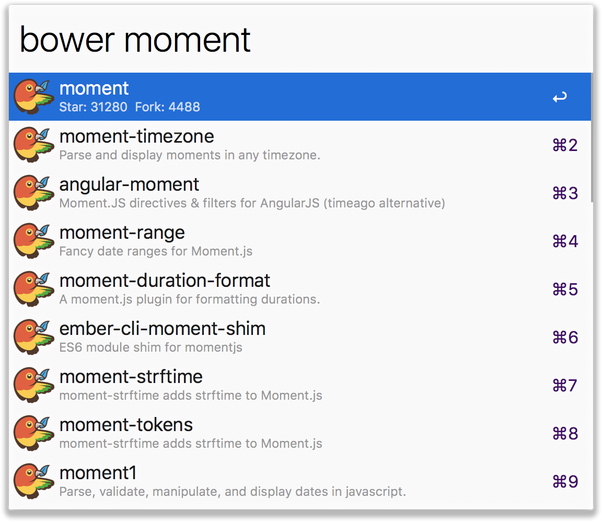

# alfred-bower

[](https://www.npmjs.com/package/alfred-bower)
[](https://github.com/LitoMore/alfred-bower/blob/master/LICENSE)
[](https://standardjs.com)

Alfred 3 workflow to search for bower packages with [Libraries.io](https://libraries.io)



## Install

```
$ npm install -g alfred-bower
```

## Usage

In Alfred, type `bower`, <kbd>return</kbd>, and type the repo name you're looking for.

Hold <kbd>command</kbd> to display the count of Star and Fork.

## License

MIT © [LitoMore](https://github.com/LitoMore)
